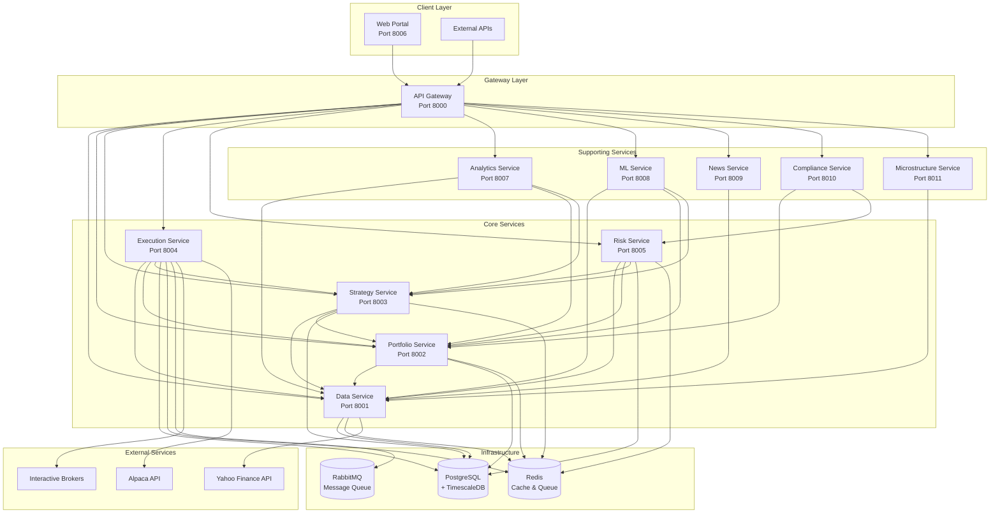

# 🗺️ Bifrost Trader Services Dependency Map

This document provides a comprehensive overview of the microservices architecture, their dependencies, and communication patterns in Bifrost Trader.

## 🎯 **Services Overview**

### **Core Services**
1. **API Gateway** (Port 8000) - ✅ **COMPLETE**
2. **Data Service** (Port 8001) - 🚧 **IN PROGRESS**
3. **Portfolio Service** (Port 8002) - 🚧 **IN PROGRESS**
4. **Strategy Service** (Port 8003) - 🚧 **IN PROGRESS**
5. **Execution Service** (Port 8004) - ❌ **PLANNED**
6. **Risk Service** (Port 8005) - ❌ **PLANNED**
7. **Web Portal** (Port 8006) - ✅ **COMPLETE**

### **Supporting Services**
8. **Analytics Service** (Port 8007) - ❌ **PLANNED**
9. **ML Service** (Port 8008) - ❌ **PLANNED**
10. **News Service** (Port 8009) - ❌ **PLANNED**
11. **Compliance Service** (Port 8010) - ❌ **PLANNED**
12. **Microstructure Service** (Port 8011) - ❌ **PLANNED**

## 🏗️ **Dependency Architecture**

## 📊 **Detailed Service Dependencies**

### **1. API Gateway (Port 8000) - ✅ COMPLETE**
**Purpose**: Central routing, service discovery, authentication
**Dependencies**: None (entry point)
**Provides**: 
- Service routing
- Load balancing
- Authentication/authorization
- Rate limiting
- Health monitoring

### **2. Data Service (Port 8001) - 🚧 IN PROGRESS**
**Purpose**: Market data ingestion, storage, and retrieval
**Dependencies**: 
- **Database**: PostgreSQL + TimescaleDB
- **Cache**: Redis
- **External**: Yahoo Finance API
**Provides**:
- Market symbol management
- Historical data storage
- Real-time data streaming
- Data validation and cleaning

**Current Status**:
- ✅ Basic FastAPI structure
- ✅ MarketSymbol and MarketData models
- ✅ Yahoo Finance service (partial)
- 🚧 Data ingestion pipeline
- ❌ Real-time data streaming
- ❌ Data validation

### **3. Portfolio Service (Port 8002) - 🚧 IN PROGRESS**
**Purpose**: Portfolio management, position tracking, P&L calculation
**Dependencies**:
- **Data Service**: For real-time pricing
- **Database**: PostgreSQL
- **Cache**: Redis
**Provides**:
- Portfolio CRUD operations
- Position tracking
- P&L calculations
- Cash balance management
- Transaction history

**Current Status**:
- ✅ Basic models (portfolio_reference.py)
- 🚧 FastAPI structure
- ❌ Business logic implementation
- ❌ Data Service integration

### **4. Strategy Service (Port 8003) - 🚧 IN PROGRESS**
**Purpose**: Strategy development, backtesting, optimization
**Dependencies**:
- **Data Service**: For historical data
- **Portfolio Service**: For position data
- **Database**: PostgreSQL
- **Cache**: Redis
**Provides**:
- Strategy development framework
- Backtesting engine
- Performance analytics
- Strategy optimization

**Current Status**:
- ✅ Backtrader framework migrated
- ✅ Cerebro integration
- ✅ Strategy templates
- 🚧 FastAPI integration
- ❌ Data Service integration
- ❌ Portfolio Service integration

### **5. Execution Service (Port 8004) - ❌ PLANNED**
**Purpose**: Order execution, trade management, broker integration
**Dependencies**:
- **Data Service**: For real-time pricing
- **Portfolio Service**: For position updates
- **Strategy Service**: For strategy signals
- **Risk Service**: For risk checks
- **Database**: PostgreSQL
- **Message Queue**: RabbitMQ
**Provides**:
- Order placement and management
- Trade execution
- Broker integration (IB, Alpaca)
- Execution reporting

### **6. Risk Service (Port 8005) - ❌ PLANNED**
**Purpose**: Risk management, compliance, position limits
**Dependencies**:
- **Data Service**: For market data
- **Portfolio Service**: For position data
- **Strategy Service**: For strategy risk
- **Database**: PostgreSQL
- **Cache**: Redis
**Provides**:
- VaR calculations
- Drawdown monitoring
- Position limits
- Compliance checking
- Risk reporting

### **7. Web Portal (Port 8006) - ✅ COMPLETE**
**Purpose**: User interface, dashboard, real-time monitoring
**Dependencies**:
- **API Gateway**: For service communication
- **Database**: PostgreSQL (direct access)
- **Cache**: Redis
**Provides**:
- User dashboard
- Portfolio visualization
- Real-time data display
- Strategy monitoring
- Trading interface

## 🔄 **Communication Patterns**

### **Synchronous Communication (REST APIs)**
- **Request-Response**: Direct API calls between services
- **Used for**: Real-time data requests, immediate operations
- **Examples**: 
  - Portfolio Service → Data Service (get current price)
  - Web Portal → Portfolio Service (get portfolio data)

### **Asynchronous Communication (Message Queue)**
- **Event-Driven**: Services publish/subscribe to events
- **Used for**: Non-critical operations, batch processing
- **Examples**:
  - Data Service → Portfolio Service (price updates)
  - Strategy Service → Execution Service (trade signals)

### **Database Sharing**
- **Shared Database**: Some services share database access
- **Used for**: Complex queries, data consistency
- **Examples**:
  - All services → Market data tables
  - Portfolio/Strategy services → Transaction tables

## 🚀 **Implementation Priority**

### **Phase 1: Foundation (Current)**
1. **Data Service** - Complete market data infrastructure
2. **Portfolio Service** - Basic portfolio management
3. **Strategy Service** - Backtesting integration

### **Phase 2: Core Trading (Next)**
4. **Execution Service** - Order execution
5. **Risk Service** - Risk management
6. **Enhanced Integration** - Service communication

### **Phase 3: Advanced Features (Future)**
7. **Analytics Service** - Advanced analytics
8. **ML Service** - Machine learning
9. **News Service** - News integration
10. **Compliance Service** - Regulatory compliance
11. **Microstructure Service** - Market microstructure

## 📋 **Service Health & Status**

### **✅ Production Ready**
- **API Gateway**: Complete and functional
- **Web Portal**: Complete with database integration

### **🚧 In Development**
- **Data Service**: Basic structure, needs enhancement
- **Portfolio Service**: Models exist, needs implementation
- **Strategy Service**: Backtrader migrated, needs API integration

### **❌ Planned**
- **Execution Service**: Not started
- **Risk Service**: Not started
- **Analytics Service**: Not started
- **ML Service**: Not started
- **News Service**: Not started
- **Compliance Service**: Not started
- **Microstructure Service**: Not started

## 🔧 **Development Guidelines**

### **Service Independence**
- Each service should be independently deployable
- Services should have their own database schemas
- Minimal direct dependencies between services

### **Communication Standards**
- Use REST APIs for synchronous communication
- Use message queues for asynchronous communication
- Implement circuit breakers for fault tolerance

### **Data Consistency**
- Use eventual consistency for non-critical data
- Implement saga pattern for distributed transactions
- Use event sourcing for audit trails

---

**🎯 This dependency map serves as the blueprint for building and integrating all Bifrost Trader services. It ensures proper service boundaries, clear dependencies, and scalable architecture.**
